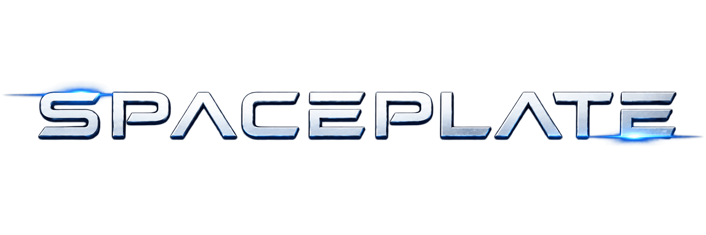

<div align="center">
  
  <p>Svelte 5 + Threlte + SpacetimeDB boilerplate for real-time 3D web apps</p>
</div>

<div align="center">
  <table>
    <tr>
      <td align="center"><a href="https://svelte.dev"></a></td>
      <td align="center"><a href="https://threlte.xyz"></a></td>
      <td align="center"><a href="https://threejs.org"></a></td>
      <td align="center"><a href="https://spacetimedb.com"></a></td>
      <td align="center"><a href="https://vitejs.dev"></a></td>
      <td align="center"><a href="https://www.typescriptlang.org"></a></td>
    </tr>
  </table>
</div>

---

A minimal, opinionated boilerplate that wires together a Svelte 5 frontend, a Threlte 3D scene, and a SpacetimeDB real-time backend — so you can skip the setup and start building.

## Features

- **Scene Manager** — Application state machine (`mainMenu` / `demoScene`) with instant switching and per-scene HUD routing
- **Rendering** — WebGPU renderer (WebGL fallback) with a node-based post-processing pipeline: SSAA, DOF, motion blur, bloom, afterimage, vignette, LUT grading, FXAA/SMAA — hot-swappable via an effect registry with quality tiers
- **Procedural sky & weather** — Day/night curve, blendable weather channels (clouds, rain, snow, wind, fog, lightning), celestial layers (moon, stars, meteors), baked environment maps, and a weather-reactive audio bed
- **Physics** — Rapier world wiring with spawnable balls/boxes, attractor modes (`static` / `linear` / `newtonian`), and debug collider toggle
- **Task scheduling** — Threlte `useTask` frame tasks with explicit ordering constraints and on-demand rendering
- **Input system** — Action-based keyboard/mouse/gamepad mapping with per-player bindings, rebinding UI, and localStorage persistence
- **Audio** — Polyphonic + one-shot playback, positional audio, autoplay-policy safe; components never unmount, so no race conditions
- **Settings** — Tabbed settings HUD (General / Audio / Controls), persistent via localStorage
- **SpacetimeDB wiring** — Connection setup, generated client bindings, example table subscription
- **Debug logging** — Multi-channel styled logging with timestamps
- **Studio editor** (`VITE_GAME_ENGINE=true`) — Dev-only Threlte Studio toolbar: scene switcher, sky/time/weather controls, post-processing panel, physics controls, GLTF viewer, sound mixers, log toggles

## Documentation

- `CLAUDE.md` / `src/CLAUDE.md` — repo layout, commands, and architecture rules
- `spacetimedb/CLAUDE.md` — SpacetimeDB SDK reference for the server module (tables, reducers, views)
- `spacetimedb/CLI.md` — `spacetime` CLI reference (init, build, publish, queries, server management)
- `DOCS/` — working notes: post-processing rebuild, weather system, scene environment, WebGPU gotchas, and `RAPIER.md` (physics integration guide)

---

## Getting Started

```sh
# install dependencies
pnpm install

# run dev server
pnpm run dev

# build for production
pnpm run build
```

### SpacetimeDB

```sh
# start local SpacetimeDB server
spacetime start

# publish module (local)
pnpm run spacetime:publish:local

# publish module (local, wipe db)
pnpm run spacetime:publish:local:fresh

# publish module (maincloud)
pnpm run spacetime:publish

# regenerate client bindings after schema changes
pnpm run spacetime:generate
```

---

## Configuration

Copy `.env.example` to `.env.local` and fill in your values.

| Variable | Description |
|---|---|
| `VITE_SPACETIMEDB_DB_NAME` | Your SpacetimeDB database name |
| `VITE_SPACETIMEDB_HOST` | SpacetimeDB host (`https://maincloud.spacetimedb.com` for maincloud) |
| `SPACETIMEDB_DB_NAME` | Same as above, used by the `spacetime` CLI |
| `SPACETIMEDB_HOST` | Same as above, used by the `spacetime` CLI |
| `VITE_GAME_ENGINE` | `true` to enable Threlte Studio + PerfMonitor + all Studio extensions |
| `VITE_STDB_ENABLE` | Set to `false` to skip the SpacetimeDB connection entirely (client runs standalone); enabled by default |
